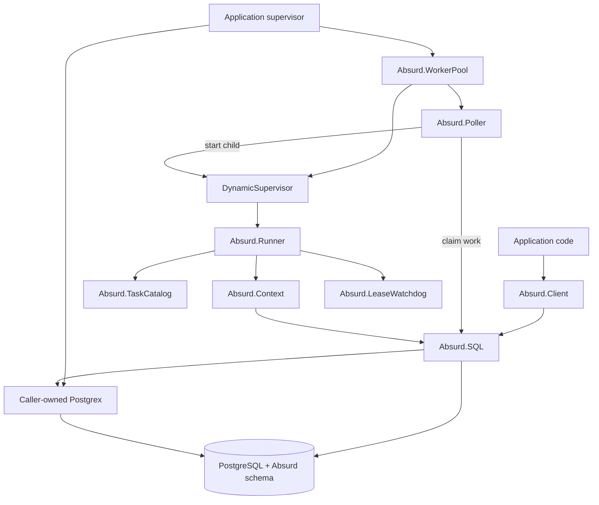

# Architecture

The SDK is intentionally split into a process-free producer side
and an OTP-supervised worker side. PostgreSQL is the durable authority for
both: BEAM processes may disappear without becoming the source of truth for a
task.

## System map



This diagram shows two different relationships:

- The `DynamicSupervisor` supervises each runner.
- The poller asks that supervisor to start runners and monitors them for
  capacity accounting. The poller is a sibling, not a runner's parent.

## Module responsibilities

| Module | Responsibility | Owns durable state? |
|---|---|---:|
| `Absurd.Client` | Validates high-level calls and supplies defaults | No |
| `Absurd.SQL` | Implements the fixed PostgreSQL protocol boundary | No |
| `Absurd.WorkerPool` | Establishes one queue's supervision boundary | No |
| Absurd.Poller | Claims work up to local capacity | No |
| `DynamicSupervisor` | Supervises temporary runner processes | No |
| Absurd.Runner | Executes and finalizes one claimed run | No |
| `Absurd.TaskCatalog` | Maps durable task names to Elixir modules | No |
| `Absurd.Context` | Exposes checkpoints, waits, events, and leases | No |
| Absurd.LeaseWatchdog | Warns and terminates locally stuck runners | No |
| PostgreSQL | Stores tasks, runs, claims, checkpoints, events, and results | Yes |

## Producer path

Spawning does not require a worker process:

1. Application code calls `Absurd.Client.spawn/4`.
2. The client resolves the task's durable name, queue, and option precedence.
3. An optional `before_spawn/3` hook may enrich the options.
4. The client validates the hook output and calls `Absurd.SQL.spawn_task/5`.
5. `Absurd.SQL` sends one parameterized call through the caller-owned Postgrex
   queryable.
6. PostgreSQL returns the task ID, run ID, attempt, and whether a new task was
   created.

`Absurd.Client` is a struct, not a process. It can also wrap a checked-out
Postgrex connection so spawning participates in an application transaction.

## Worker supervision

Each worker pool consumes exactly one queue:

```text
Absurd.Supervisor
└── Absurd.WorkerPool
    ├── DynamicSupervisor
    │   └── Absurd.Runner (one per active claim)
    └── Absurd.Poller
```

The pool uses `:rest_for_one`, with the runner supervisor before the poller.
That ordering gives failures precise consequences:

- If the runner supervisor exits, the poller also restarts because its capacity
  accounting is no longer valid.
- If only the poller exits, existing runners survive. Its replacement discovers
  and monitors them before claiming more work.
- During shutdown, the poller stops first and waits for active runners up to the
  configured grace period. The runner supervisor is stopped afterward.

The worker pool validates its task catalog and exact database schema version
before starting either child, so an incompatible worker never claims work.

## Claim and execution path

1. The poller calculates `concurrency - active_runners`.
2. It asks PostgreSQL to claim at most that capacity and `batch_size`.
3. For every claimed row, it calls `DynamicSupervisor.start_child/2` with a
   temporary runner.
4. It monitors each runner. A `:DOWN` message returns one unit of capacity and
   triggers an immediate refill poll.
5. The runner resolves the stored task name through its immutable task catalog.
6. It creates an execution context, invokes the task callback, and normalizes
   the callback's tagged result.
7. It asks PostgreSQL to complete or fail the run, then exits normally.

OTP never restarts a completed runner. PostgreSQL's retry policy decides
whether a failed or abandoned attempt creates another runnable attempt, which
will receive a new runner after it is claimed.

## Durable steps

Task callbacks restart from their beginning on every attempt. Checkpoints make
that safe:

1. `Absurd.Context.begin_step/2` allocates a deterministic occurrence name.
2. A committed checkpoint returns a completed handle and user code reuses its
   stored JSON value.
3. A missing checkpoint lets the application perform the work.
4. `complete_step/3` persists the value and extends the active lease in one
   database operation.
5. Only after PostgreSQL confirms the write does the context update its local
   cache and reset the lease watchdog.

The context's linked Agent caches checkpoints and occurrence counters only for
the current execution. Losing it cannot lose committed progress because the
next attempt reloads visible checkpoints from PostgreSQL.

External effects remain at least once. If an effect succeeds and the process
dies before its checkpoint commits, it can run again. The decomposed step API
provides a stable idempotency key for services that support deduplication.

## Sleeps and events

A future sleep first checkpoints its absolute wake time, then schedules the run
using the database clock. The context sends a private control signal to unwind
the callback without completing or failing it. The runner exits and releases
its worker slot.

Event waiting asks PostgreSQL to resolve an existing event or transition the
run to sleeping atomically. This avoids losing an event between a read and a
separate sleep write. Event delivery later makes the run claimable again.

The control signal contains a unique context reference. The runner recognizes
only a signal from the current context; unrelated task throws remain failures.
An ambiguous context write also unwinds through this signal and suppresses
competing finalization, since the run may already have durably suspended.

## Leases and stuck work

The database claim is the authoritative lease. Checkpoint completion and
`Absurd.Context.heartbeat/2` extend it.

Each runner also links a local watchdog that remains schedulable when task code
blocks the runner:

- At one lease duration it logs a warning.
- At two lease durations it kills only the disposable runner.
- A confirmed database lease extension replaces both timers.

The watchdog does not renew leases in the background. Long-running task code
must make explicit progress through checkpoints or heartbeats.

## Failure outcomes

| Failure | Outcome |
|---|---|
| Task returns `{:error, reason}` or raises | Runner records a bounded failure; PostgreSQL applies retry policy |
| Runner or node disappears | Claim eventually expires and PostgreSQL decides recovery |
| Task name is absent during a rollout | Run is deferred with deterministic jitter |
| Poller exits | Supervisor restarts it; surviving runners are recounted |
| Database rejects work as cancelled or failed | Context unwinds immediately and performs no competing finalization |
| Connection is lost during a mutating call | SDK reports `:ambiguous` and does not guess whether it committed |
| Pool shuts down | New claims stop before active runners drain |

## Delivery contract

- Task execution is at least once across attempts.
- Compatible committed checkpoints replay.
- External effects require their own idempotency strategy.
- Cancellation is durable but cannot undo an effect already running elsewhere.
- Logs and telemetry describe observed behavior; they are not durability proof.
- PostgreSQL—not process memory—is the final authority.

## Suggested reading order

To follow one complete request through the implementation, read:

1. `Absurd.Client`
2. `Absurd.SQL`
3. `Absurd.WorkerPool`
4. Absurd.Poller
5. Absurd.Runner
6. `Absurd.Context`
7. Absurd.LeaseWatchdog
